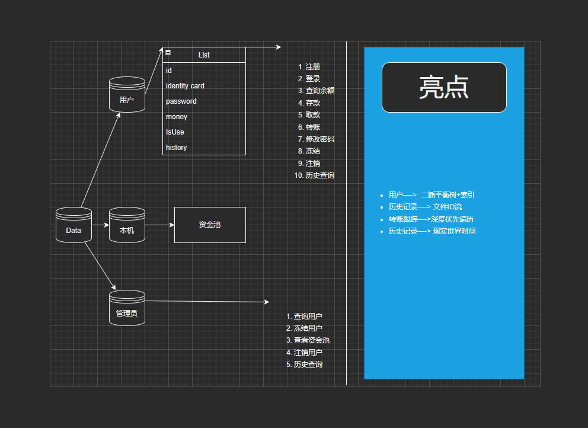

# AutomaticTellerMachine

## 业务流程图



## 可执行文件

exe文件位于 AutomaticTellerMachine\x64\Release\AutomaticTellerMachine.exe

## 代码阅读

代码文件保存格式为: Unicode（UTF-8 带签名）-代码页65001

建议使用 Visual Studio 2022 打开

（若dev打开乱码，又不想安装Visual Studio，您可以使用系统自带的记事本打开）

## 重新编译

### 环境

#### Windows11 or Windows10 正版

#### Visual Studio 2022

```
https://visualstudio.microsoft.com/
```

#### QT 6_4_1

```
https://www.qt.io/download-qt-installer?hsCtaTracking=99d9dd4f-5681-48d2-b096-470725510d34%7C074ddad0-fdef-4e53-8aa8-5e8a876d6ab4
```

### 部署

```
https://blog.csdn.net/ColinFhz/article/details/107879769
```

## 数据库

本系统考虑了测试环境可能没有mysql环境，所有采用多txt文件构建本地数据库，数据位于 AutomaticTellerMachine\x64\Release\data

如果您删除了数据库，那么程序将在下一次运行的时候自动创建数据库

请勿对数据库内的文件进行修改，否则将可能导致程序数据读取错误

## 资金库

资金库默认初始值为： 100000.0

资金库默认最大值为：1000000.0

您可进入Machine.cpp 对 INIT_Capital_Pools 与 MAX_Capital_Pools 进行修改，并重新编译运行

## 管理员系统

本系统为单管理员系统，管理员由代码直接写死，您可进入 Administrator.cpp 对 AdministratorID 与 AdministratorPassword 进行修改，并重新编译运行

默认管理员：    	账号为： 福州大学至诚学院              密码为： 123456

## github代码仓库

```
https://github.com/jiyilin/AutomaticTellerMachine
```

项目已开源，您可随意拉取，本人将对项目进行长期维护
